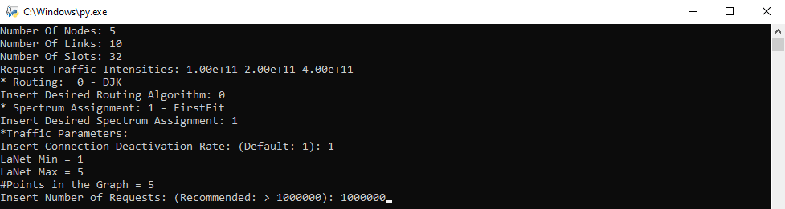
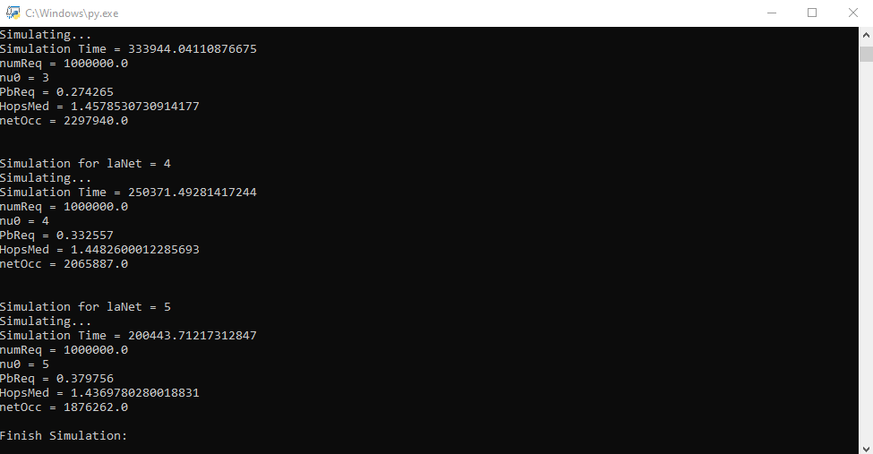

# SimEON (Aka. Simão)- Simulador de redes ópticas elásticas

Adaptação do simulador de redes elásticas desenvolvido pelo Professor Raul Camelo. 

São necessários fornecer a alguns parâmetros através do console que as simulações serão geradas. As informação da simulação serão salvas em um arquivo .csv.

## Como executar o projeto?

O projeto utiliza o Python 3.8 ou superior sem a necessidade de extessões extras, sendo assim, basta fazer o download do [Python aqui](https://www.python.org/downloads/). Após o download, durante o processo de instalação é necessário marcar a caixa autorizando a adição do Python ao path do sistema (em caso de Windows, Linux e Mac o Python é nativo do sistema).

> Em caso de Linux e Mac é necessário modificar o arquivo ```settings.py``` para direcionar o caminho para os arquivos da forma que é aceita pelo sistema. No windows é dado por "\\\\" e no Linux é "/".

Com o Python instalado e em funcionando basta fazer o download desse projeto e executar o arquivo ```main.py``` na raiz do projeto. Outra forma é executar o comando ```main.py``` através de uma interface de desenvolvimento. Minha recomendação fica para o [VS Code](https://code.visualstudio.com/download) usando a extensão do [Python pela Microsoft](https://code.visualstudio.com/docs/languages/python).

Ao executar o arquivo uma tela solicitando os seguintes parâmetros será mostrada.
- Insert Desired Routing Algorithm: Escolhe o algoritmo de roteamento. (No momento só o Dijkstra está implementado).
- Spectrum Assignment: é a escolha do algortimo que será usado para alocar o comprimento de onda. (No momento só o FirstFit está implementado).
- Insert Connection Deactivation Rate:
- LaNet Min: Carga mínima
- LaNet Max: Carga máxima
- Points in the Graph: Intervalo de divisão da carga
- Insert Number of Requests: Número máximo de requisções. Escolher valores acima de 1000000 para uma boa confiança dos dados.



Quando a simulação for concluida você deverá ver os resultados no console e os resultados estarão disponiveis no arquivo .csv.



## Social medias


[](https://www.linkedin.com/in/matheus-lobo-dos-santos/)
[](https://t.me/thematheusls)